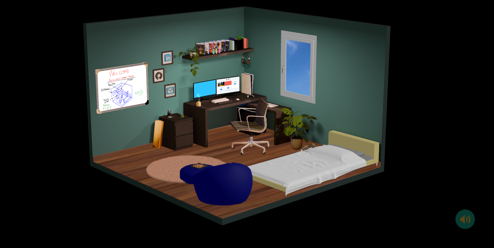

# Aniket Kit's Portfolio Website #

Welcome to my 3D portfolio website GitHub repository! This project showcases my work and creativity in an interactive 3D environment, built using Three.js.

You can explore it [here](https://aniketkit.vercel.app/).
___

## 🌟 Features ##

* 3D Environment: Fully interactive 3D portfolio website with immersive visuals.

* Whiteboard: A digital whiteboard where visitors can write and draw.

* Dual Monitors: One monitor displays my projects, and the other provides information about me.

* Interactive Rubik's Cube: A solvable Rubik's Cube for an engaging user experience.

* Three.js Integration: Utilizes Three.js for rendering and managing 3D models and scenes.

* 3D Models: Includes optimized 3D character models and objects designed for the site.

* Lighting Effects: Realistic lighting and shadow effects for enhanced visuals.

___
## 🛠️ Technologies Used

* Three.js: For rendering 3D objects and animations.

* GLB Models: Used GLB files for 3D models to ensure compatibility and lightweight performance.

* JavaScript: Core scripting for interactivity.

* HTML & CSS: For structuring and styling the website.

* Blender: For creating and exporting the 3D models.

* Vite: Used as the development and build tool.

___
## 🖼️ Preview ##

___
## 📜 License

This project is licensed under the [MIT License](LICENSE).
